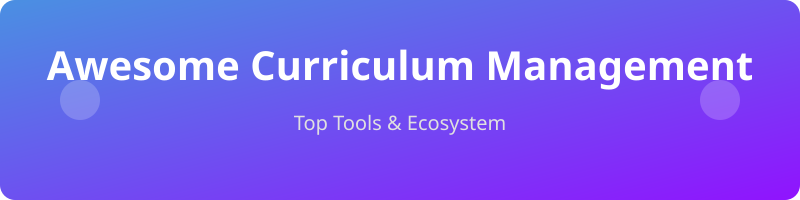

 

 

# 📚 Awesome Curriculum Management

An SEO-friendly, curated list of the best **Curriculum Management** software, SaaS products, and Open-Source GitHub projects for schools, districts, and higher education.

## 🌟 Top Curriculum Management Tools Ecosystem

**Curated List of SaaS Products & Open-Source GitHub Projects**

*Focused on Curriculum Mapping, Unit Planning, Standards Alignment, Scope & Sequence, and Academic Program Management*

**Last updated: August 2026**

This repository tracks notable **SaaS platforms** and **open-source projects** for **Curriculum Management**. These tools help schools, districts, and higher-education institutions design, map, align, review, and continuously improve curriculum — including unit planning, standards alignment, scope-and-sequence management, and collaborative curriculum development.

**Examples** include Atlas Curriculum Management, Chalk Curriculum, ManageBac, Toddle, Eduplanet21, CourseLeaf Curriculum, Watermark Planning & Self-Study, OpenEduCat, Classter, and Blackbaud Curriculum (the category leaders and widely used platforms).

**Open-source emphasis**: Dedicated full-featured open-source curriculum mapping platforms are relatively scarce compared with LMS or SIS tools. This section highlights the strongest available open-source options for curriculum mapping, unit planning, standards alignment, and related education management systems that institutions can self-host and extend.

Contributions welcome! Open a PR to add/update entries. Keep descriptions factual and link to official sites / GitHub repos.

## 📑 Table of Contents

- [SaaS/Hosted Platforms](#saas-hosted-platforms)

- [Open-Source GitHub Projects](#open-source-github-projects)

- [How to Contribute](#how-to-contribute)

- [Disclaimer](#disclaimer)

## ☁️ SaaS/Hosted Platforms

| Product | Description | Pricing (Starting Tier) | Free Tier / Trial Limits | Company Size / Valuation |
| :--- | :--- | :--- | :--- | :--- |
| **[Chalk Curriculum](https://www.chalk.com/)** | Curriculum and instruction platform focused on planning, standards alignment, and making curriculum visible and actionable for teachers and leaders. | £5.99/month (Pro) | Occasional use with monthly limits on generations | ~$4.3B (Acquired by PowerSchool) |
| **[Blackbaud Curriculum](https://www.blackbaud.com/)** | Part of Blackbaud’s education suite supporting curriculum and academic operations for independent schools and institutions. | ~$9/student/year | No free trial / demo only | ~$4B (Market Cap) |
| **[Watermark Planning & Self-Study](https://www.watermarkinsights.com/)** | Assessment, planning, and self-study tools that support curriculum review, accreditation, and continuous improvement processes. | ~$15,000/year | No free trial / demo only | ~$1.5B (Acquired by Thoma Bravo) |
| **[Atlas Curriculum Management](https://www.rubicon.com/atlas-curriculum-management/)** | Widely adopted curriculum mapping and management platform used by schools and districts for unit planning, standards alignment, and collaborative curriculum development. | ~$3,500/year | 30-day free trial (standard limits) | ~$1B (Acquired) |
| **[Rubicon Atlas](https://www.rubicon.com/)** | Additional commercial platforms frequently used for standards-based curriculum mapping and vertical/horizontal alignment. | ~$3,500/year | 30-day free trial | ~$1B (Acquired) |
| **[ManageBac](https://www.managebac.com/)** | Popular platform for IB and international schools covering curriculum planning, assessment, reporting, and portfolio management. | ~$10/student/year | 30-day free trial | ~$800M (Faria Education Group) |
| **[Toddle](https://www.toddleapp.com/)** | Modern, design-forward curriculum and learning platform strong in unit planning, progression tracking, and teacher collaboration. | ~$12/student/year | 30-day free trial | ~$75M (Series A) |
| **[CourseLeaf Curriculum](https://www.courseleaf.com/)** | Higher-education focused curriculum and catalog management solution used by universities for program and course governance. | ~$10,000/year | No free trial / demo only | ~$50M |
| **[Eduplanet21](https://www.eduplanet21.com/)** | Professional learning and curriculum platform supporting curriculum design, mapping, and educator development. | ~$5,000/year | 14-day free trial | ~$15M |
| **[Classter](https://www.classter.com/)** | All-in-one student and academic management platform that includes curriculum and academic structure capabilities. | €6.50/student | 14-day free trial | ~$12M (Seed/Series A) |
| **[OpenEduCat](https://openeducat.org/)** | Education ERP with strong curriculum, course, and academic management modules available in commercial deployments. | $59/month | Free forever Community Edition (unlimited students/time) | ~$10M |

## 🔓 Open-Source GitHub Projects

- **[ERPNext](https://github.com/frappe/erpnext)** 

  Top tier open-source ERP system that includes robust modules for education, student management, and curriculum tracking.

- **[Open edX](https://github.com/openedx/edx-platform)** 

  Leading open-source learning management systems frequently used alongside or as delivery layers for curriculum, with varying degrees of planning and alignment support via plugins or custom development.

- **[Moodle](https://github.com/moodle/moodle)** 

  Leading open-source learning management systems frequently used alongside or as delivery layers for curriculum, with varying degrees of planning and alignment support via plugins or custom development.

- **[Canvas LMS Community](https://github.com/instructure/canvas-lms)** 

  Leading open-source learning management systems frequently used alongside or as delivery layers for curriculum, with varying degrees of planning and alignment support via plugins or custom development.

- **[OpenEduCat](https://github.com/openeducat/openeducat_erp)** 

  Comprehensive open-source education ERP (LGPL) with modules for course/subject management, academic structure, curriculum planning elements, LMS features, and campus operations. One of the strongest open foundations for institutions wanting full academic control.

- **[RosarioSIS](https://github.com/FrancoisJacquet/rosariosis)** 

  Open-source student information systems that support academic scheduling, course management, and related curriculum structures.

- **[Gibbon](https://github.com/GibbonEdu/core)** 

  Flexible open-source school platform that includes academic structure, departments, courses, and planning-related features usable for curriculum organization.

- **[Frappe Education](https://github.com/frappe/education)** 

  Education module built on the Frappe framework offering academic program, course, and related management capabilities that can be extended for curriculum workflows.

- **[openSIS](https://github.com/OS4ED/openSIS-Classic)** 

  Open-source student information systems that support academic scheduling, course management, and related curriculum structures.

- **[CurriculumStart](https://github.com/icarnaghan/CurriculumStart)** 

  Open-source curriculum mapping framework designed for Expeditionary Learning, Project-Based Learning, and traditional course models.

- **[ProjectCampus](https://github.com/projectcampus/projectcampus)** 

  An open-source digital campus tool allowing institutions to manage courses and programs collaboratively.

- **[OpenEduCat Core](https://github.com/openeducat/openeducat_core)** 

  Core framework for OpenEduCat, essential for base curriculum and campus setups.

### Additional Strong Open-Source Options

- Custom curriculum mapping built on open CRMs, Notion-like tools, or low-code platforms using structured databases for units, standards, and alignments.

- Standards databases and alignment helpers that feed into mapping workflows.

- AI-assisted unit and lesson planning tools (emerging open projects) that generate draft maps aligned to frameworks.

- Integration of open LMS platforms with dedicated mapping spreadsheets or lightweight web apps for hybrid solutions.

- Higher-education catalog and program management tools built on open frameworks.

**Frameworks for building custom systems**: Many institutions combine **OpenEduCat** or another open SIS/ERP for academic structure with **TODCM** or custom unit templates for mapping, and an open LMS (**Moodle** / **Open edX**) for delivery. Standards alignment and reporting can be layered via SQL views, spreadsheets, or lightweight custom applications — resulting in a fully owned curriculum management stack.

## 🤝 How to Contribute

1. Fork the repo.

2. Add/edit entries in `README.md` (follow existing format).

3. Include: name, link, 1–2 sentence description, and whether it's SaaS or open-source.

4. Submit PR with a short explanation.

Star the repo if you find it useful!

## ⚠️ Disclaimer

- This is a **community-curated** list — not exhaustive and not an endorsement.

- Curriculum management tools should be evaluated for standards framework support, collaboration features, reporting/alignment analytics, ease of teacher adoption, and total cost of ownership (including self-hosting and customization effort).

- Pure open-source curriculum mapping platforms are fewer than commercial offerings; many successful open implementations combine an education ERP/SIS with mapping-specific tools or custom development.

---

**Made for curriculum directors, instructional coaches, school leaders, and education technologists who want transparent, adaptable, and affordable curriculum management infrastructure.**

Let's make curriculum mapping, unit planning, and standards alignment more open, collaborative, and free from rigid proprietary systems.

## 📈 Star History

